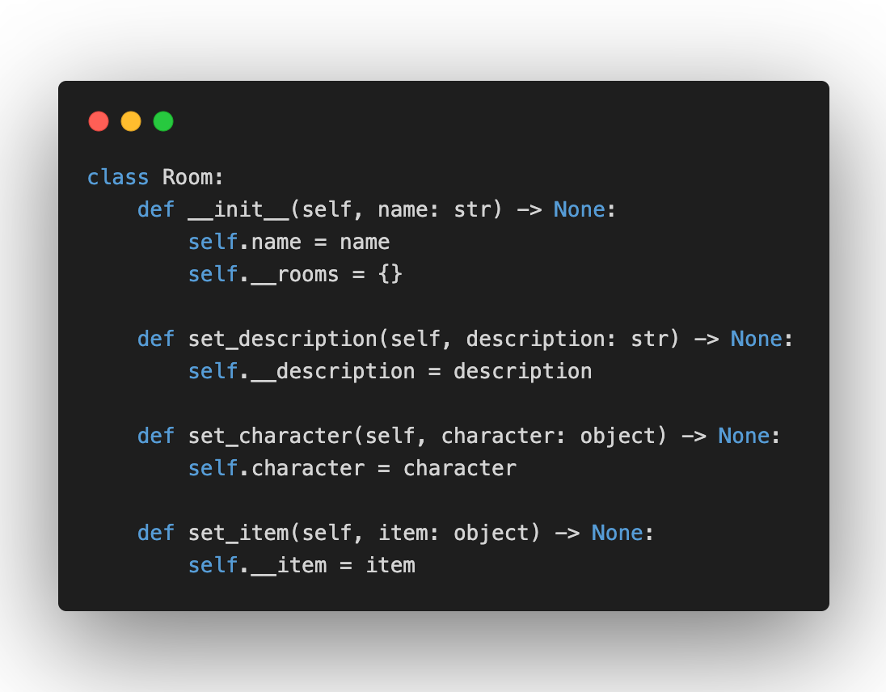
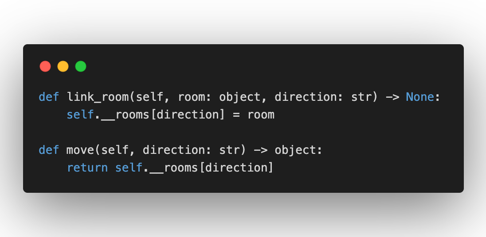
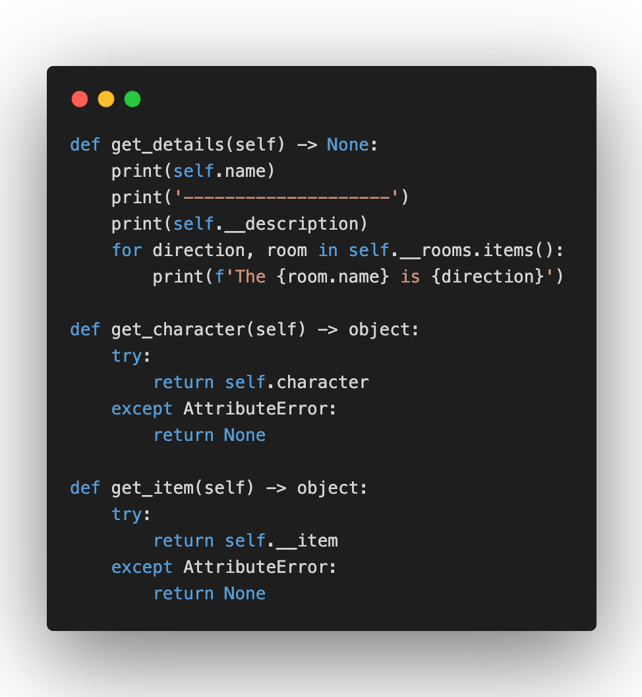
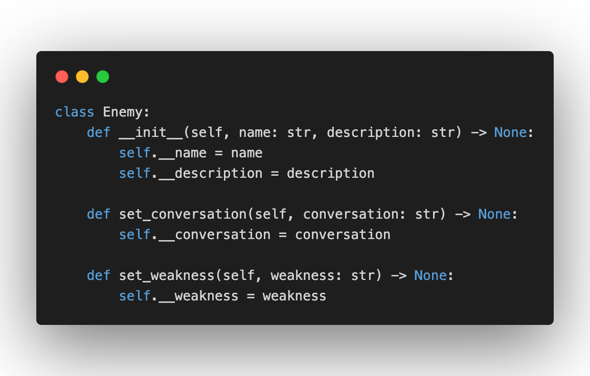
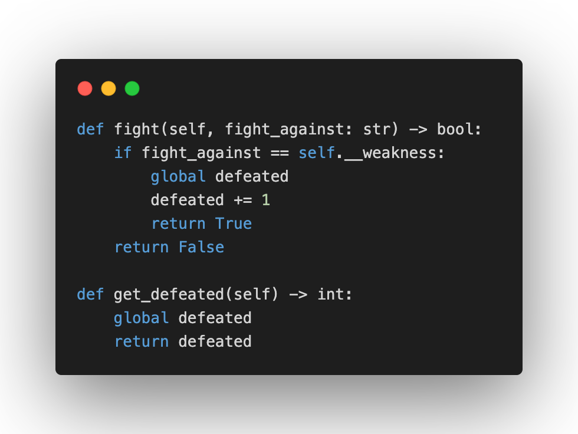
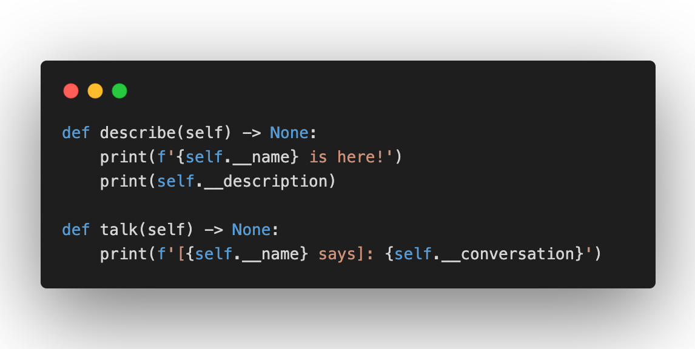
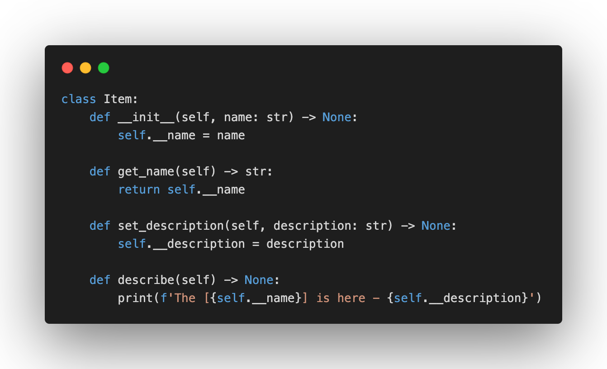

# room-game
Модуль `game.py` складається з трьох класів: `Room`, `Enemy` та `Item`.

## Room

Клас `Room` має атрибути `name` - назва кімнати, `__rooms` - список кімнат, що знаходяться поблизу кімнати, `__description` - опис кімнати, `character` - персонаж, який знаходиться в кімнаті та `__item` - предмет, що знаходиться в кімнаті.

Метод `link_room` додає у словник `__rooms` кімнату, де ключем є напрямок, у якому знаходиться кімната, наприклад: *north*, *west*, а значенням - обʼєкт класу `Room`.

Метод `move` отримує напрямок та повертає обʼєкт кімнати, яка знаходиться за цим напрямком.

Метод `get_details` виводить на екран опис кімнати.

Методи `get_character` та `get_item` перевіряють чи обʼєкту були присвоєні антрибути `character` та `__item` за допомогою методів `set_character` та `set_item`, та повертають обʼєкти класів `Enemy` та `Item` відповідно.

## Enemy

Клас `Enemy` має атрибути `__name` - імʼя персонажа, `__description` - опис персонажа, `__conversation` - репліка, яку використовуватиме персонаж та `__weakness` - слабкість персонажа.

Метод `fight` отримує предмет з яким буде битися `Enemy` та порівнює його зі слабкістю ворога. Також цей метод додає один до глобальної змінної `defeated`, яка означає кількість ворогів, яких переміг персонаж.

Метод `get_defeated` повертає значення змінної `defeated`.

Методи `describe` та `talk` виводять на екран опис ворога та його репліку.

## Item

Клас `Item` має атрибути `__name` - назва предмета та `__description` - опис предмета.

Метод `describe` повертає опис предмета.

